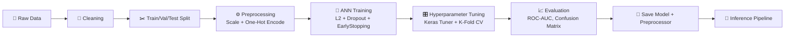

<div align="center">

# 📉 Customer Churn Prediction System

### End-to-end Deep Learning pipeline that predicts telecom customer churn using an Artificial Neural Network

[](https://www.python.org/)
[](https://www.tensorflow.org/)
[](https://scikit-learn.org/)
[](#-results)

[Overview](#-overview) •
[Pipeline](#-pipeline) •
[Results](#-results) •
[Project Structure](#-project-structure) •
[Setup](#-setup) •
[Inference](#-inference-example) •
[Limitations](#-limitations)

</div>

---

## 📖 Overview

In the telecom industry, acquiring a new customer costs **5–25x more** than retaining an existing one. This project builds a **production-style deep learning system** that predicts whether a customer will churn (`Yes` / `No`) from their demographic, account, and subscription data — giving retention teams a way to proactively target at-risk customers before they leave.

| | |
|---|---|
| 🎯 **Task** | Binary classification (Churn / No Churn) |
| 🧠 **Model** | Artificial Neural Network (Keras / TensorFlow) |
| 📊 **Dataset** | [IBM Telco Customer Churn](https://www.kaggle.com/datasets/blastchar/telco-customer-churn) — 7,043 customers, 21 features |
| ⚖️ **Class balance** | ~73% No Churn / ~27% Churn |
| 🏆 **Test ROC-AUC** | **~0.84** |

---

## 🔄 Pipeline



1. **EDA** — class imbalance, contract-type impact, tenure vs. churn behavior
2. **Data Cleaning** — drop `customerID`, fix `TotalCharges` type/missing values, encode target
3. **Preprocessing** — `StandardScaler` + `OneHotEncoder`, fitted **only on the training split** (no data leakage)
4. **Split** — 70% / 15% / 15% train/val/test, stratified on the target
5. **Model** — ANN with L2 regularization, Dropout, EarlyStopping, and class weighting
6. **Tuning** — manual learning-rate sweep, 5-fold cross-validation, Keras Tuner random search
7. **Evaluation** — classification report, confusion matrix, ROC-AUC on the held-out test set
8. **Baseline** — Random Forest classifier for comparison
9. **Deployment** — model + preprocessor saved to disk with a reusable inference function

---

## 📊 Results

**Test set — final tuned model**

| Metric | No Churn | Churn |
|:---|:---:|:---:|
| Precision | 0.90 | 0.54 |
| Recall | 0.76 | 0.78 |
| F1-score | 0.82 | 0.63 |

<div align="center">

| Model | Test AUC |
|:---|:---:|
| Baseline ANN | 0.8444 |
| **Tuned ANN (deployed)** | **0.8437** |
| Random Forest | 0.8172 |

</div>

- **Overall Accuracy:** ~76%
- **ROC-AUC:** ~0.84
- Class weighting was used to prioritize **recall on the churn class**, since missing an at-risk customer costs the business more than a false alarm.

---

## 🗂 Project Structure

```
.
├── Customer_Churn_Prediction_System.ipynb   # Full end-to-end pipeline (EDA → deployment)
├── Customer_Churn_Prediction_System.pptx    # Project presentation
├── predict.py                               # Standalone inference script
├── streamlit_app.py                         # Interactive churn-risk console (Streamlit)
├── main.py / index.html                     # FastAPI + web UI deployment
├── requirements.txt                         # Python dependencies
├── runtime.txt / Procfile                   # Deployment config
├── best_churn_model.h5                      # Initial model checkpoint (pre-tuning)
├── final_churn_model.h5                     # ✅ Final tuned model (used for inference)
├── preprocessor.pkl                         # Fitted scaler + encoder for inference
└── README.md                                # This file
```

---

## ⚙️ Setup

```bash
git clone https://github.com/Riyadh101/Deep-Learning-Project.git
cd Deep-Learning-Project
pip install -r requirements.txt
```

Download `Telco-Customer-Churn.csv` from the [Kaggle dataset page](https://www.kaggle.com/datasets/blastchar/telco-customer-churn), place it in the project root, then run the notebook top to bottom.

---

## 🚀 Inference Example

```python
from predict import predict_customer_churn

sample_customer = {
    'gender': 'Female', 'SeniorCitizen': 0, 'Partner': 'Yes', 'Dependents': 'No',
    'tenure': 2, 'PhoneService': 'Yes', 'MultipleLines': 'No',
    'InternetService': 'Fiber optic', 'OnlineSecurity': 'No', 'OnlineBackup': 'No',
    'DeviceProtection': 'No', 'TechSupport': 'No', 'StreamingTV': 'Yes',
    'StreamingMovies': 'Yes', 'Contract': 'Month-to-month', 'PaperlessBilling': 'Yes',
    'PaymentMethod': 'Electronic check', 'MonthlyCharges': 85.70, 'TotalCharges': 171.40
}

prob, pred = predict_customer_churn(sample_customer)
print(f"Churn probability: {prob:.2%}  |  Prediction: {'Churn' if pred else 'No Churn'}")
```

Or launch the interactive console:

```bash
streamlit run streamlit_app.py
```

---

## ⚠️ Limitations

- Trained on a single snapshot of one telecom provider's data — may not generalize to other markets or time periods without retraining.
- Precision on the churn class (~0.54) is moderate; roughly half of customers flagged as "at risk" will not actually churn — a deliberate trade-off given the class weighting toward recall.
- No temporal/behavioral features (e.g., usage trends over time) — only static account attributes are used.
- Decision threshold is fixed at 0.5; a production deployment should tune it against the real business cost of false negatives vs. false positives.

---

## 🧰 Tech Stack

<div align="center">

`Python` · `TensorFlow / Keras` · `scikit-learn` · `Keras Tuner` · `pandas` · `matplotlib / seaborn` · `Streamlit` · `FastAPI`

</div>

---

## 👥 Team

<div align="center">

| Name |
|---|
| Riyadh |
| Mohammed Al-Hujaili |
| Mishari |
| Yasser Al-Ghamdi |
| Nawaf Zakari |

</div>

<div align="center">

Made with 🧠 by the team above

</div>
